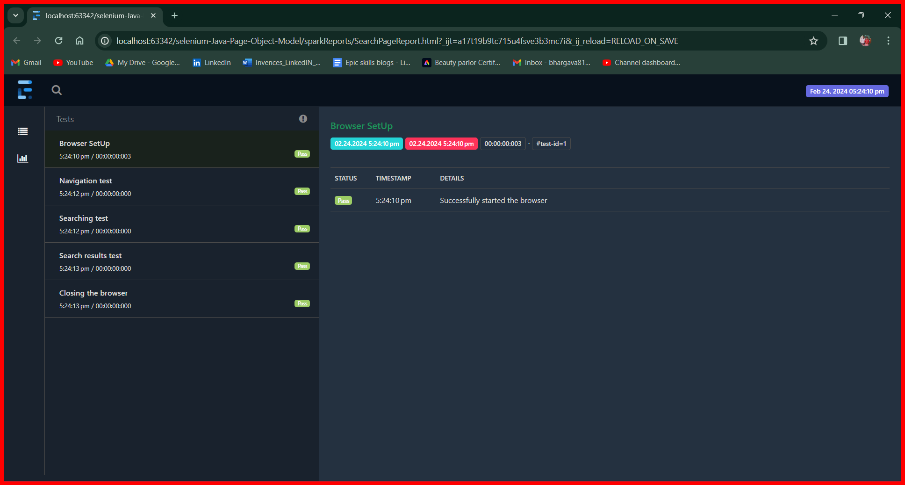

<h3>Author: Bhargava Reddy Chinthareddy</h3>

<h4>Library: Selenium, TestNG</h4>

<h4>Language: Java - <b>JDK 21</b></h4>

<h4>Reporter: Extent reports</h4>

<h4>IDE: IntelliJ Idea</h4>

<h4>Framework: Page Object Model(Hybrid model)</h4>

<h4>Date of publish: January 9th 2024</h4>

<h4>Description:</h4>
<ol>
<li>The code is for learning, training and reference purpose only.</li>
<li>The code is for Google search automation testing purpose.</li>
</ol>

<h4>File structure:</h4>

All the code files are in src folder. All the setup code for the tests are in under in java folder under 
main folder in src folder.

<ul>
<li>Credentials:

Contains all the hard coded values like search text, username, password, etc., can be or are stored.
</li>
<li>Drivers:

Contains code for driver set up and browser options
</li>
<li>ObjectRepository:

Contains all the elements code used in the file. The elements of each page should be stored separately.
</li>
<li>Page Repository:

Contains all the code used in the test. The code for each page should be created separately

Code in a single file can be used in different test files.

</li>
<li>Extent reports:

Contains all the Extent setup code used in the Project.

Step name and log line are given in the test file with the use of constructors

</li>
<li>url:

Contains hard coded values of all url's used in the test.
</li>
</ul>

All the code for to print log's in the console is placed under resources' folder.

All the test code is placed under test folder.

<ul><li><b>Java:</b></li>

Contains all the test steps. The test steps of each page are stored separately
</ul>
<h5>Logs</h5>

All the logs generated during the test are saved under test.log file under logs folder.

<h4>Reporter</h4>

Extent reporter is the reporter used in this project

The report will be generated like this

